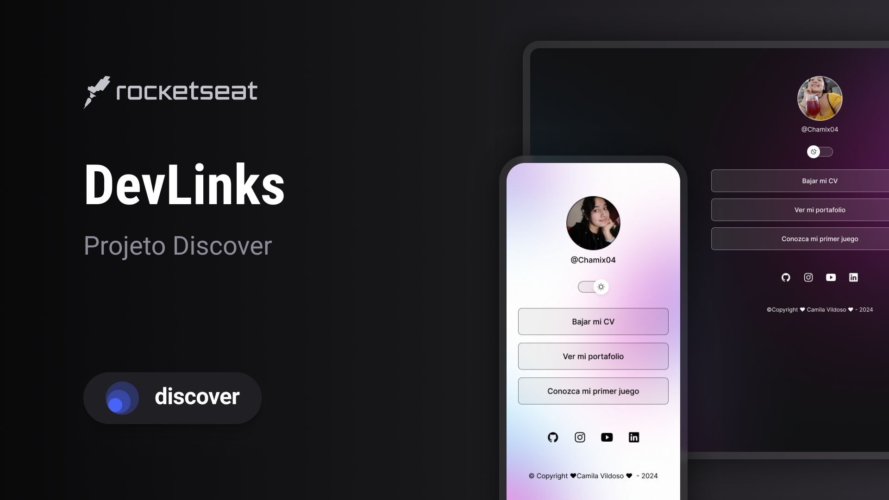

<h1 align="center">DevLinks</h1>

 Programa exclusivo y gratuito, promovido por Rocketseat para la enseñanza de tecnologías WEB.

  <a href="#-tecnologias">Tecnologias</a>&nbsp;&nbsp;&nbsp;|&nbsp;&nbsp;&nbsp;
  <a href="#-projeto">Projeto</a>&nbsp;&nbsp;&nbsp;|&nbsp;&nbsp;&nbsp;
  <a href="#-layout">Layout</a>&nbsp;&nbsp;&nbsp;|&nbsp;&nbsp;&nbsp;

## 💻 Tecnologías 

Este proyecto fue realizado con las siguientes tecnologías:

- HTML y CSS
- JavaScript
- Git y Github
- Figma

## 📝 Proyecto
Con Devlinks podremos realizar un agregado de links para poder usar como una carta de presentación.

## 🔗 Link

Pueden visualizar el proyecto através [DEL LINK](https://www.figma.com/community/file/1187422022288947321) es necesario tener cuenta en [Figma](https://figma.com) para entrar.